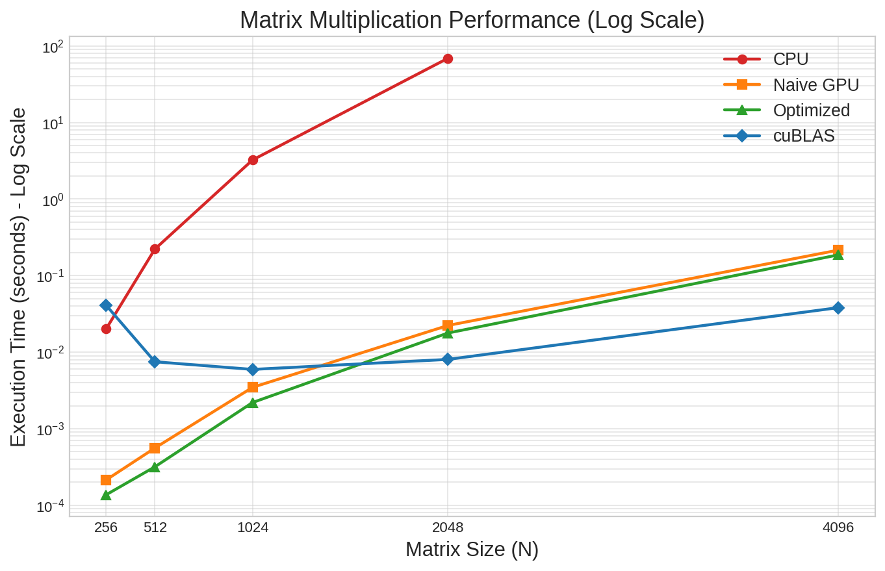
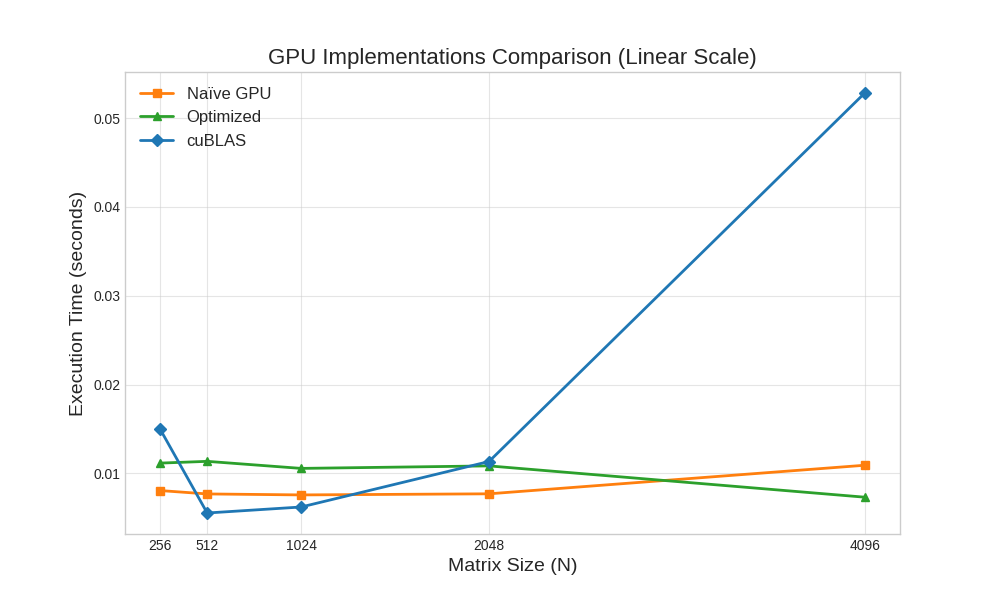
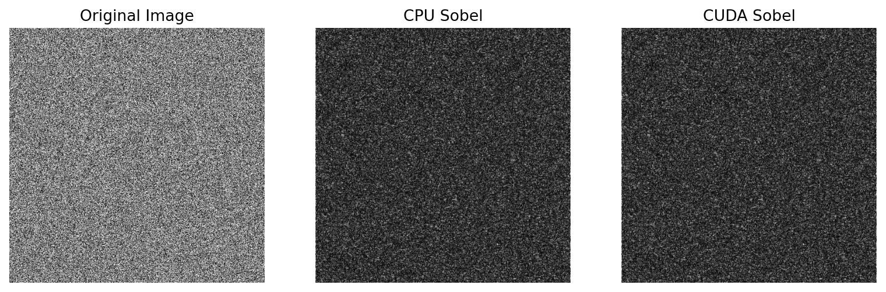

# CUDA Acceleration Primitives

CUDA C++ implementations of core acceleration patterns used in machine learning and image-processing workloads: matrix multiplication, shared-memory tiling, cuBLAS benchmarking, and Python-callable GPU convolution.

This repository is positioned as an AI/MLE systems portfolio project. The goal is to show that I can reason about GPU kernels, benchmark boundaries, and Python/CUDA integration rather than only call high-level ML libraries.

## Highlights

- Implemented CPU, naive CUDA, shared-memory tiled CUDA, and cuBLAS matrix multiplication benchmarks.
- Built a Python-callable CUDA shared library with `ctypes` for 2D convolution and Sobel edge detection.
- Compared custom kernels against CPU baselines and NVIDIA library primitives on an NVIDIA Tesla T4 environment.
- Added reproducible scripts for collecting benchmark CSVs and regenerating plots.

## Why This Matters for AI/MLE Work

Modern ML systems often bottleneck on tensor operations, preprocessing, feature extraction, and data movement. This project demonstrates lower-level skills that are useful when profiling inference pipelines, writing custom CUDA extensions, evaluating GPU utilization, or deciding when to use vendor libraries such as cuBLAS instead of maintaining a custom kernel.

## Repository Structure

```text
.
|-- collect_results.py              # Compiles/runs matrix benchmarks and writes results/final_comparison.csv
|-- plot_matrix_performance.py      # Generates benchmark plots from results/final_comparison.csv
|-- CUDA_Acceleration_Primitives.ipynb  # Colab verification notebook
|-- matrix_gpu.cu                   # Naive CUDA matrix multiplication
|-- matrix_gpu_optimized.cu         # Shared-memory tiled CUDA matrix multiplication
|-- matrix_cublas.cu                # cuBLAS SGEMM benchmark
|-- matrix_lib.cu                   # Python-callable CUDA matrix multiplication library
|-- test_lib.py                     # ctypes smoke test for libmatrix.so
|-- cpu/
|   |-- matrix_cpu.c                # CPU O(N^3) baseline
|   `-- result.csv                  # CPU-only timing reference
|-- convolution/
|   |-- convolution_lib.cu          # CUDA convolution kernel + C ABI wrapper
|   |-- convolution_standalone.cu   # Standalone CUDA convolution benchmark
|   |-- test_convolution.py         # Python ctypes benchmark and visualization
|   `-- results/                    # Convolution output images
`-- results/                        # Matrix benchmark CSV and plots
```

## Results

### Matrix Multiplication

Benchmarked on Google Colab with an NVIDIA Tesla T4 GPU. GPU timings are measured with CUDA events around the kernel or cuBLAS call only (allocation and the first context-initializing call happen before the timed window); host-device transfers are intentionally excluded for this compute-kernel comparison. CPU timings measure the baseline CPU compute loop. Numbers below are the current `results/final_comparison.csv` (also the source of the plots).

| Implementation | N=256 | N=512 | N=1024 | N=2048 | N=4096 |
| --- | ---: | ---: | ---: | ---: | ---: |
| CPU | 0.021160s | 0.314571s | 3.503723s | 75.699278s | Timeout |
| Naive GPU | 0.000264s | 0.000592s | 0.004152s | 0.032821s | 0.262257s |
| Optimized Tiled CUDA | 0.000146s | 0.000342s | 0.002369s | 0.018067s | 0.194119s |
| cuBLAS | 0.052196s | 0.006267s | 0.006413s | 0.008388s | 0.037842s |

At scale the ranking is the expected one: **cuBLAS < optimized tiled < naive <<< CPU**. The naive kernel scales roughly as O(N³) (2048→4096 is ~8×), the tiled kernel is ~1.35–1.8× faster than naive at every size, and cuBLAS dominates at large N. **Known measurement caveats:** these are single-run timings with no warmup and no averaging, so the small-N points are noisy — the cuBLAS N=256 outlier (0.052s) is a one-time library-initialization cost landing inside the timed window, not a real compute result. The matmul results are also not yet asserted against a NumPy/CPU reference (the tiled `main` comments out the device→host copy), so correctness is visually plausible but unverified. See the fix (warmup + averaged iterations + correctness check) in `not-gonna-used/matrix_benchmark_fixed.cu`.





### CUDA Convolution from Python

The convolution module exposes C ABI functions from CUDA C++ and calls them from Python with `ctypes`. The benchmark uses a Sobel 3x3 edge filter while varying image size, then uses 5x5 and 7x7 box filters to test larger stencil workloads.



## Reproduce the Benchmarks

### Requirements

- NVIDIA GPU with CUDA toolkit and `nvcc`
- Python 3.9+
- Python packages: `numpy`, `pandas`, `matplotlib`
- Optional for the original environment: Google Colab T4 GPU

For a notebook-based run, open `CUDA_Acceleration_Primitives.ipynb` in Colab with a GPU runtime. The notebook follows the same commands below and is meant as a reproducible project demo rather than a course lab handout.

The scripts default to `sm_75` for Tesla T4. To target another GPU, set `CUDA_ARCH`:

```bash
CUDA_ARCH=sm_86 python collect_results.py
```

### Matrix Multiplication

```bash
python collect_results.py
python plot_matrix_performance.py
```

Outputs:

- `results/final_comparison.csv`
- `results/plot_log_scale.png`
- `results/plot_gpu_only.png`

### Python + CUDA Convolution

```bash
nvcc -arch=sm_75 -Xcompiler -fPIC -shared convolution/convolution_lib.cu -o convolution/libconvolution.so
python convolution/test_convolution.py
```

Outputs:

- `convolution/results/edge_detection_result.png`
- `convolution/results/convolution_output_demo.png`
- `convolution/results/comparison.png`

Optional standalone benchmark:

```bash
nvcc -arch=sm_75 convolution/convolution_standalone.cu -o convolution/convolution_standalone
./convolution/convolution_standalone
```

## Implementation Notes

- The optimized matrix kernel uses 16x16 shared-memory tiles to reduce repeated global memory reads.
- The cuBLAS benchmark is included as a vendor-library reference point, which is usually the right production choice for dense linear algebra.
- The convolution wrapper currently allocates/copies/frees GPU memory inside each Python call, so its timing is closer to an end-to-end Python integration benchmark than the matrix kernel-only timing.
- For interview discussion, the next natural optimizations would be CUDA error-checking macros, pinned host memory, persistent device buffers for repeated convolution calls, correctness checks against NumPy, and Tensor Core or WMMA experiments for matrix multiplication.
